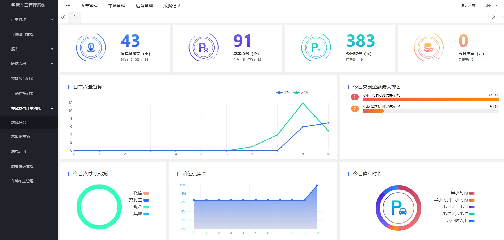
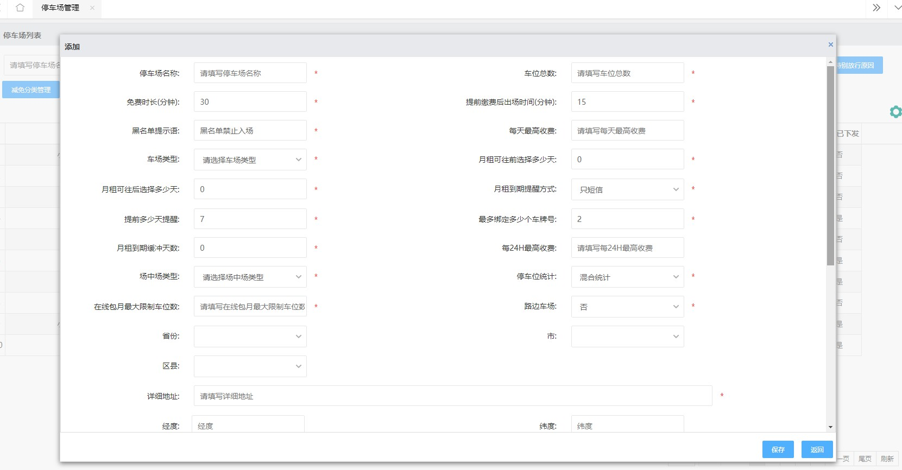

# Iparking停车收费管理系统-可商用

# 介绍

Iparking是一款基于springBoot的停车收费管理系统，支持封闭车场和路边车场，支持微信支付宝多种支付渠道，支持多种硬件，涵盖了停车场管理系统的所有基础功能。开源版本适合学习，做毕业设计使用，只是后台管理系统，不包含停车收费业务逻辑，企业版本包含所有功能。

## 技术栈

Springboot,Mybatis Plus,Beetl,Mysql,Redis,RabbitMQ，UniApp

## 功能
#### 云端功能
|  序号 | 模块   | 功能  | 描述   |
| ------------ | ------------ | ------------ | ------------ |
|  1 |  系统管理 | 菜单管理  | 配置系统菜单  |
| 2  |  系统管理 | 组织管理 | 管理组织机构  |
| 3  |  系统管理 | 角色管理 | 配置系统角色，包含数据权限和功能权限配置  |
| 4  |  系统管理 | 用户管理 | 管理后台用户  |
| 5  |  系统管理 | 租户管理 | 多租户管理  |
| 6  |  系统管理 | 公众号配置 | 租户公众号配置  |
| 7  |  系统管理 | 操作日志 | 审计日志  |
| 8  |  系统管理 | 商户管理 | 配置支付商户  |
| 9  |  车场管理 | 车场管理 |  管理停车场，车位，特殊放行分类 |
| 10  |  车场管理 | 出入口管理 | 管理封闭车场出入口 |
| 11  |  车场管理 | 地磁管理 | 管理路边停车地磁设备  |
| 12  |  车场管理 | 收费员管理 | 管理路边和封闭车场的收费员  |
| 13  |  运营管理 | 收费规则 | 包含月租户收费规则，临时车收费规则  |
| 14  |  运营管理 | 黑名单管理 | 管理停车场黑名单车辆  |
| 15  |  运营管理 | 免费车管理 | 包括临时免费车，永久免费车，一次性免费车  |
| 16  |  运营管理 | 月租户管理 | 月租户管理，月租户充值，退费  |
| 17  |  运营管理 | 商户管理 | 商户开通，商户充值，商户账单  |
| 18  |  运营管理 | 数据修复 | 重新下发场端数据  |
| 19  |  数据记录 | 临时订单 | 路边，封闭车辆产生的停车费订单  |
| 20  |  数据记录 | 月租户订单 | 在线包月费用订单  |
| 21  |  数据记录 | 月租户订单 | 在线包月费用订单  |
| 22  |  数据记录 | 网关支付订单 | 所有的网关支付订单  |
| 23  |  数据记录 | 出入场流记录 | 查询停车场出入场记录  |
| 24  |  数据记录 | 特殊放行记录 | 查看收费员特殊放行记录  |
| 25  |  数据记录 | 手动抬杆记录 | 查看收费员手动抬杆记录  |
| 26  |  数据记录 | 在场车辆 | 查看各个停车场在场记录  |
| 27  |  数据记录 | 收费员下线收费报表 | 统计收费员线下收费情况  |
| 28  |  数据记录 | 收入总览报表 |  查看某个停车场一个月各种收费情况 |
| 29  |  数据记录 | 停车时长统计 | 统计车辆停车时长  |
| 30  |  数据记录 | 停车流量统计 | 统计各个时间段停车流量  |
| 31  |  数据记录 | 网络对账 | 查看与各个支付渠道网络支付流水的对账情况  |
| 32  |  数据记录 | 消息记录 | 查看微信公众号模板消息，短信发送的记录  |
| 33  |  数据记录 | 大屏 | 统计大屏  |

#### 场端功能
|  序号 |  功能  | 描述   |
| ------------ |  ------------ | ------------ |
|  1 |  出入口监控 | 监控出入口视频，最多支持4路，理论上支持更多可以二开  |
|  2 |  出入场记录 | 查看出入场记录  |
|  3 |  线下收费 | 断网等情况可以线下收费  |
|  4 |  特殊放行 | 部分领导打招呼的车辆，还有公检法等可以进行特殊放行  |
|  5 |  手动抬杆 | 遇到三轮车，快递等可以操作手动抬杆  |
|  6 |  交接班 | 下班交接班  |

#### 路边(路测车位)功能(PDA)

|  序号 |  功能  | 描述   |
| ------------ |  ------------ | ------------ |
|  1 |  入场 | 车辆入场可以执行入场  |
|  2 |  问题车辆 | 一直占用车位不开走的车辆列表  |
|  3 |  巡查 | 对车位状态进行刷新和标记  |
|  4 |  收费 | 可以操作现金收费，特殊放行  |
|  5 |  包月车辆 | 查看包月车辆  |
|  6 |  欠费单 | 车辆离场不交费可产生欠费单  |
|  7 |  收费记录 | 查看收费记录  |
|  9 |  出入场记录 | 查看出入场记录  |
|  9 |  数据统计 | 简单的几个报表  |
|  10 |  交接班 | 下班交接班  |

#### 公众号功能(支持支付宝生活号)

|  序号 |  功能  | 描述   |
| ------------ |  ------------ | ------------ |
|  1 |  绑定车牌 | 车主绑定车牌  |
|  2 |  包月 | 在线包月  |
|  3 |  临停收费 | 在线缴纳临停费用  |
|  4 |  无牌车出入场 | 新车可通过无牌车出入场进场并缴费  |

## 系统截图

## 演示环境

http://park.sxpartner.com/   

admin  123456

## 联系作者：
扫描二维码加作者微信：    

